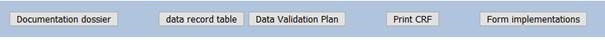
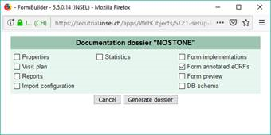

# How to get annotated CRFs

Data users (e.g. statisticians) will often find an annotated version of a CRF useful. The annotations provide the mapping between the online database and what appears in data exports. Annotated CRFs are very easy to create in secuTrial.

1. FormBuilder
2. "Document Dossier"

    

3. Select "Form annotated CRFs" only

    

4. Save the html file.
5. To view the annotated CRF, open the index.html file (double clicking will open it in the default browser).
6. The bar on the left allows quick navigation amongst the forms.

