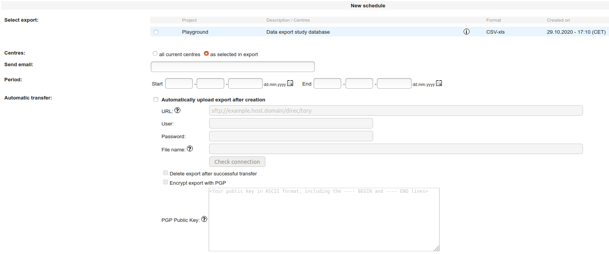

# Automatic export of secuTrial exports

1. ExportSearchTool
2. Click "Export schedule"
3. Click "New schedule"
4. Select a previously set up export.

```
Note: If you have not yet set up an export then you 
      should have a look at the "Data export" recipe. 
```

5. Specify all fields in the form as required.  

  

6. Server URL, User, Password will likely need to be discussed with your local IT admin.
7. Click "Check connection". If successful, a "Test.txt" file should have been uploaded
   to the place where the export is intended to end up.
8. Enable PGP encryption if deemed necessary.

Brief description of pgp key pair setup in Linux with `gpg` command line tool.

``` bash
# generate key pair
# select for example:
#        (1) RSA and RSA (default)
#        4096
#        0 = key does not expire
# and follow through typing the info
# that is requested
# e.g. Real name: John Doe
#      Email address: John.Doe@online_services.com
#      Comment: John Does PGP Keys
#      Password: *****
gpg --full-generate-key
# return will look something like this
# pub   rsa4096 2020-10-29 [SC]
#       B20479972437334F62D375F901CF5CC22F189BA1
# uid                      John Doe (John Does PGP Keys) <John.Doe@online_services.com>
# sub   rsa4096 2020-10-29 [E]

# show public key, open unencrypted text
gpg --armor --export B20479972437334F62D375F901CF5CC22F189BA1
# show private key, open unencrypted text (this will prompt for the password that was used during key generation)
gpg --armor --export-secret-keys B20479972437334F62D375F901CF5CC22F189BA1
```

Exporting your keys from your "current machine" to an "other machine":  
*This assumes your keys are available on the "current machine" but not on the "other machine".*

``` bash
# On your "current machine"
# export public key to file john_doe_pub.key
gpg --export B20479972437334F62D375F901CF5CC22F189BA1 > john_doe_pub.key
# export private key to file john_doe_priv.key
gpg --export-secret-keys B20479972437334F62D375F901CF5CC22F189BA1 > john_doe_priv.key

# copy these files to the "other machine" (e.g. with scp)

# import the public key to the keyring on the "other machine"
gpg --import john_doe_pub.key
# import the private key to the keyring on the "other machine"
gpg --import john_doe_priv.key
```

This recipe was tested under secuTrial version 5.6.2.2
