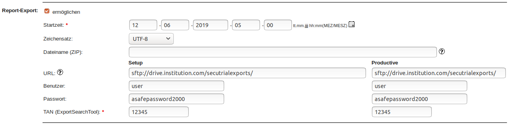

# Automatic export of secuTrial reports

```
Note: The automatic transfer of reports via SFTP is described in 
      the manual of the CustomerAdminTool in section 5.1.
```

1. CustomerAdminTool
2. Click "Schemata"
3. Select "Schema" for which you would like to set up automatic export of reports.
4. Click the checkbox next to "Report-Export".
5. Configure according to your personal specifications.

    

1. FormBuilder
