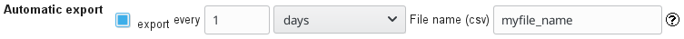

# Automatic export of secuTrial free SQL reports

```
Note: The automatic transfer of reports is described in 
      the manual of the CustomerAdminTool in section 5.1.
```

1. CustomerAdminTool
2. Click "Schemata"
3. Select "Schema" for which you would like to set up automatic export of reports.
4. Click the checkbox next to "Report-Export".
5. Configure according to your personal specifications.  

```
Note: A detailed explanation of how to set up the server
      should be discussed with a systems administrator.
      An example can be found below.
```
<details><summary>Click here for more details</summary>
<p>

Register RSA key for your SFTP server on your secuTrial server:
1. This can be achieved by adding the SFTP server's RSA key to the ".ssh\known_hosts" file on your secuTrial server.
2. You can use "ssh-keyscan" to obtain the RSA key of your SFTP server.Create a user on your SFTP server:
``` bash
useradd -s /bin/false user
passwd user# create directories
# (only this directory will be writable by SFTP)
mkdir -p /home/user/secutrialexports# set permissions
chown root:root -R /home/user/
chmod 755 /home/user/
chown user:user /home/user/secutrialexports
chmod 755 /home/user/secutrialexports/
chmod g+s /home/user/secutrialexports/# edit SSH config
# (/etc/ssh/sshd_config)
# ----------------------------------------->8---------------------------------------# [...]
AllowUsers user
# [...]# [...]
# must be at the very end of the file
Match User user
   ChrootDirectory /home/user/
   ForceCommand internal-sftp
   AllowTCPForwarding no
   X11Forwarding no
# ----------------------------------------->8---------------------------------------# restart SSH
service ssh restart
```

</p>
</details>

  

6. FormBuilder
7. Select your project of interest.
8. Click "Edit reports"
9. Select the free SQL report you would like to export.
10. Click the "export" checkbox
11. Specify how often the report should be exported.
12. Specify a file name.

  

The example above will export myfile_name.csv once a day.


This recipe was tested under secuTrial version 5.5.1.10
