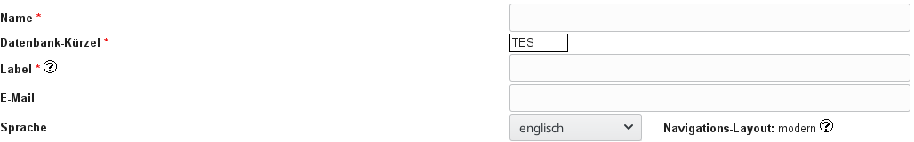

# Change the language of a secuTrial data export

1. CustomerAdminTool
2. Select customer area
3. Change "Sprache" to what you need.

  

``` 
Note: Changing the language affects several 
      files in the export.
```
