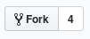
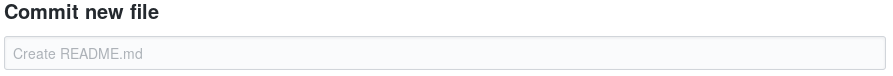
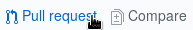
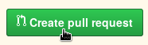

In order to help out writing recipes you of course need to know how you can do that. This recipe is intended to show you how to add a new recipe to the SCTO repository without having to use the command line.

1. Create your own fork of the main recipes repository by clicking "Fork" on the top right. The main repository is [here](https://github.com/SwissClinicalTrialOrganisation/DM_secuTrial_recipes).



2. Navigate to your personal fork, which is now on you personal github page.
3. To create a new recipe, first come up with a two to three word description and click "Create new file". (example: create_user_logins)


4. Type the two to three word description (words are connected via underscores) into to box where it says "Name your file..." followed by "/README.md". This will create a directory for your recipe and initialize the README.md file in which you will write the recipe.


5. Scroll to the bottom of the page and write a useful commit message to replace the placeholder "Create README.md". (example: initializing new recipe on user login creation)



6. Click "Commit new file" to commit your changes.


7. To edit the README.md you can click the pen symbol (top right).


8. In the edit mode you can write your recipe and commit at the bottom of the page. Again with a meaningful commit message. You can use the already available recipes as template to learn Markdown. 
9. Once you have finished and commited your final changes you can click "Pull request" and then "Create pull request".




10. In the dialogue that opens you can type an extended description if you would like to and then click "Create pull request" a final time.
11. Now all you need to do is wait for an administrator to merge your pull request.

``` diff
- Note: If you would like to initialize a fig directory for figures or screenshots you can do this 
-       the same way you created your recipe directory. Just navigate to your personal recipe directory
-       click "Create new file" and type "fig/yourimagename.png" and commit this. You can then upload your
-       actual image by navigating to the fig directory and clicking "Upload files". 
-       Then "choose your files" and "Commit changes".
```
