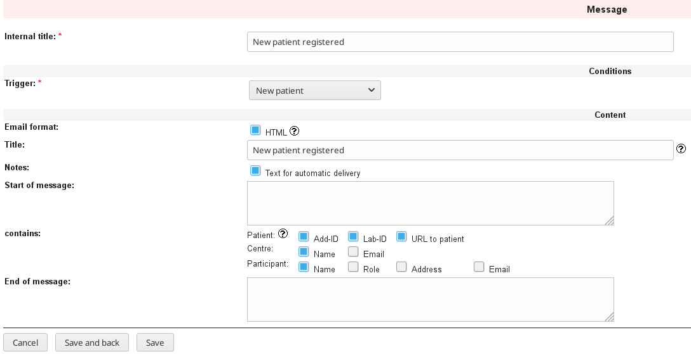
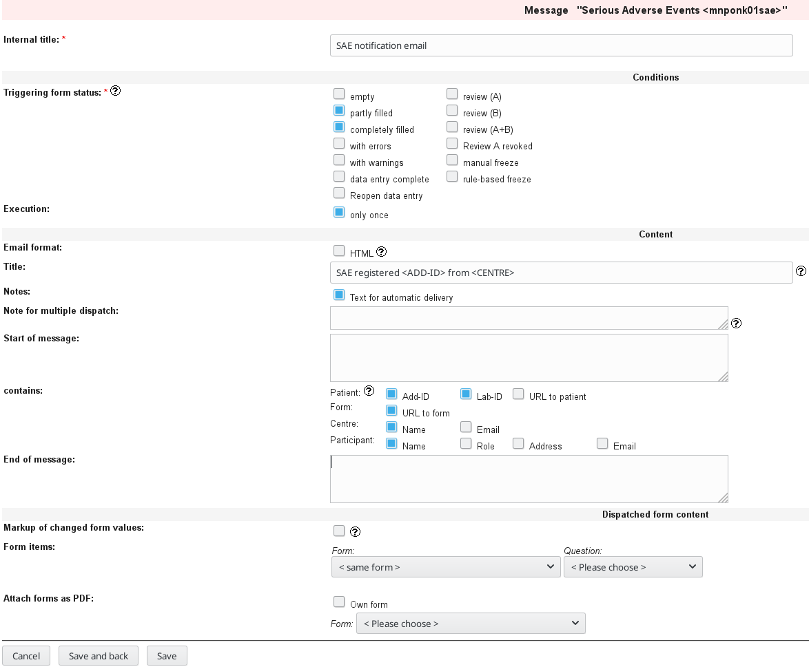

# Creating email notifications 

In some cases it may be helpful to enable automatic email notifications for certain events. For example emails can be triggered when new patients are entered into the database or an email can be sent when a [serious adverse event](https://en.wikipedia.org/wiki/Serious_adverse_event) (SAE) is recorded.

```diff
 Note: Email notifications need to be enabled within 
       the AdminTool via "Resources" -> "Messages".
```

### Setup an email notification:
1. FormBuilder -> "Edit configuration"
2. In "Messages" click "New message" (Bottom of the page)
3. Set internal title (e.g. "New patient registered")
4. Set trigger (e.g. "New patient")
5. Specify further contents of email to you preferences

    


### Emails for specific forms (e.g. SAE form) can be setup within the form:
1. FormBuilder -> navigate to the form
2. Click "New Message"
3. Set internet title (e.g. "SAE notification email")
4. Set Triggering form status (e.g. "partly filled", "completely filled")
5. Execution "only once"

    


This recipe was tested under Secutrial version 5.5.1.10
