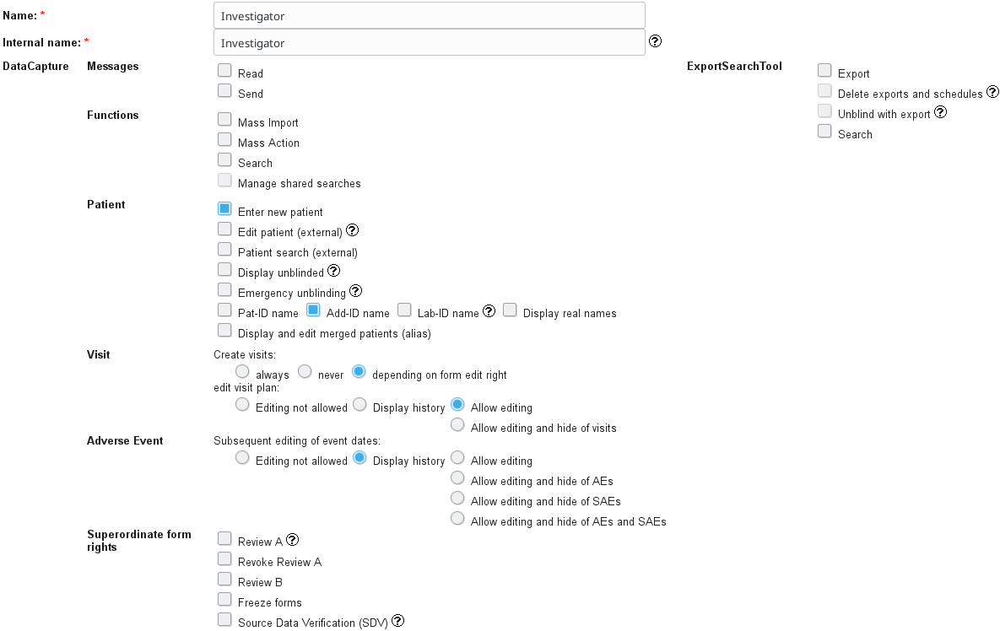
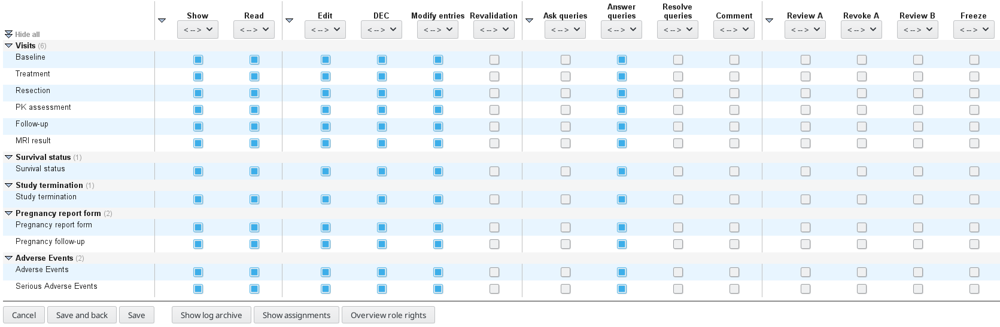

# Creating user accounts, roles and centers 

Before creating accounts it is advisable to create centers and user roles. All this can be performed in the AdminTool.

#### Centers

1. Click "Centres" in the navigation bar on the top of the page
2. "New centre"
4. Set adequate Prefix
3. Further specifications are self explanatory

#### Roles

1. Click "Roles" in the navigation bar on the top of the page
2. "New participant role"
3. The setup for an investigator role can look like the following screenshot  
(a further example for monitors is available in the [fig](fig) directory)

    
    

#### Participants

1. Click "Participants" in the navigation bar on the top of the page
2. "New participant"
3. Fill in the relevant information (at least "Last name", "User-ID", "New password", "Email")
   (Note that the Password will have to be changed on first login)
4. Optionally specify "Preferred report" in "Preferences"
5. At the bottom of the page in "Centres" -> "Add project or centre" and specify according to who you are creating to login for. Note: Do not forget to click "Add"
6. Click "Send credentials via E-Mail" if you would like secuTrial to handle the user notification

This recipe was tested under secuTrial version 5.5.1.10
