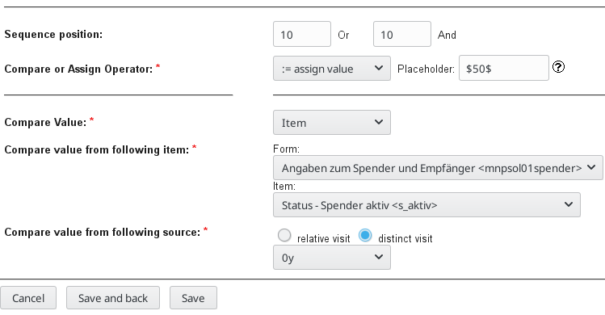
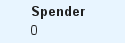
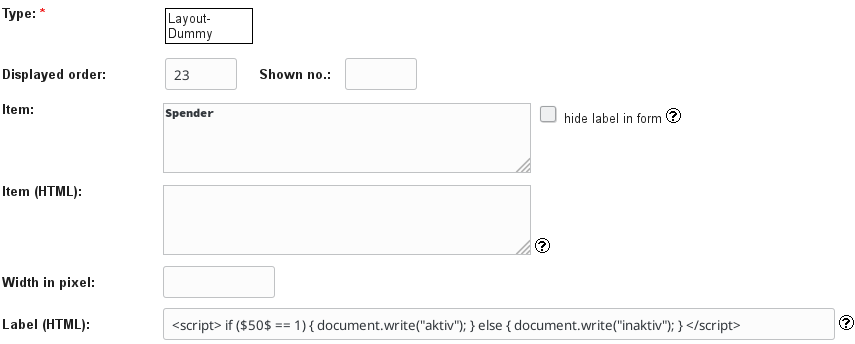
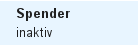

# Decoding coded variables with JavaScript in secuTrial 

```
 Note: Starting from secuTrial version 5.5.0.10 this 
       is no longer needed.
```

In some cases you may be asked to display values of variables in a form that have been
captured in a different form. A simple example is a Yes/No radiobutton. 
In the background "Yes" is commonly coded as a "1" and "No" as a "0".


secuTrial allows you to display this value elsewhere by setting the rule "Display value from ..."
within a "Layout-Dummy" item. The placeholder (e.g. $50$) variable gives you access to the value. 



Within HTML active fields of the "Layout-Dummy" the placeholder can be entered.
However, secuTrial will only display the coded form. This can be problematic especially when more than two options are encoded.



JavaScript can remedy such problems. Please note that the placeholder variable is used within the JavaScript code.

```javascript
<script>
if ($50$ == 1) { 
    document.write("aktiv"); 
} else { 
    document.write("inaktiv"); 
} 
</script>
```

Such scripts can be used within all HTML active fields in the FormBuilder.



Now the display shows the decoded value.


 

