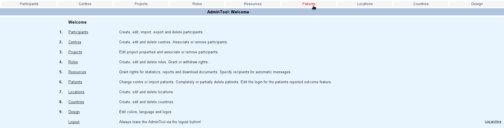
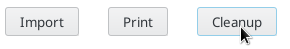
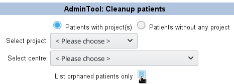
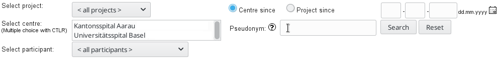
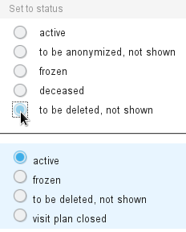
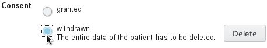

# Deleting saved patients/cases

Both in the setup and the productive environment it is occasionally necessary to delete saved patients or cases.
In the setup environment you may simply want to clean up a multitude of registered records which have become obsolete.
There is usually hardly any risk involved in deleting records from setup. This is also the reason you can delete in bulk 
in setup. In the productive environment it is different. You can only remove one record at a time.
Here you need to be completely sure that what you are deleting really needs to be removed. 

```
Note: Deleting records is permanent and can not be undone.
```

 **Deleting in setup**:

1. AdminTool
2. Click "Patients" (can be called differently depending on the "Design" setup)

  
  
3. If you would like to remove all then click "Cleanup".

  
  
4. "Select project" and uncheck "List orphaned patients only"

  
  
5. Select all "Remaining patients" and click "->" to stage them for deletion.
6. Click "Delete" and confirm "Delete".

If you would like to remove individual patients in setup you can follow the 
description provided below (productive deletion).


 **Deleting in productive**:

1. AdminTool
2. Click "Patients" (can be called differently depending on the "Design" setup)

  
  
3. Enter specific ID of patient/case you would like to delete into "Pseudonym" field.

  

4. Click "Search"
5. Select it by clicking one of its ids.
6. Click "Edit status"
7. In the top part only select "to be deleted, not shown".

  
  
8. Click "Set status"
9. Click "Save"
10. In "Consent" select "withdrawn The entire data of the patient has to be deleted."

  
  
11. Click "Delete" and confirm "Delete".

This recipe was tested under Secutrial version 5.5.1.10
