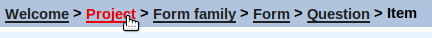

# Did you know ...

This is a list of observations which do not merit a recipe of their own but have proven useful in the past.

- ... that at the bottom of a form page you can click "Overview Items" for a list of all items in the given form? 
      The variable names are editable in the overview. This is useful if you need to change many variable names.
      
  

- ...  that you can quickly navigate in the secuTrial FormBuilder by using the navigation on the top left? e.g. jump from an Item to the Project overview.

  

- ... that you can retrieve a preview, implementation overview or annotated eCRF on the top right in the secuTrial FormBuilder? The preview allows you to view the eCRF without logging in to the DataCapture. The annotated eCRF and implementation add more technical details to the preview. Using the browser search can be useful if you are searching for specific variables in long forms.

  
