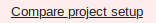

# Did you know ...

This is a list of observations which do not merit a recipe of their own but have proven useful in the past.

- ... that you can "Generate default-mappings" in the FormBuilder when you "Edit import formats"? This can greatly simplify the process of mapping your import data to the CDMA.  
  

- ... that the FormBuilder allows you to hide items, questions, forms and entire visits in the productive DataCapture?  
  Items and forms:  
    
  Visits (Edit visit plan -> right side next to the visits):  
    
  If data previously entered into hidden elements should be exported or not can be specified in the ExportSearchTool:  
    

- ... that you can compare different productive project setups with each other in the FormBuilder?  
  first click:  
    
  then select versions to compare:  
  

- ... that at the bottom of a form page you can click "Overview Items" for a list of all items in the given form? 
      The variable names are editable in the overview. This is useful if you need to change many variable names.
      
  

- ...  that you can quickly navigate in the secuTrial FormBuilder by using the navigation on the top left? e.g. jump from an Item to the Project overview.

  

- ... that you can retrieve a preview, implementation overview or annotated eCRF on the top right in the secuTrial FormBuilder? The preview allows you to view the eCRF without logging in to the DataCapture. The annotated eCRF and implementation add more technical details to the preview. Using the browser search can be useful if you are searching for specific variables in long forms.

  
