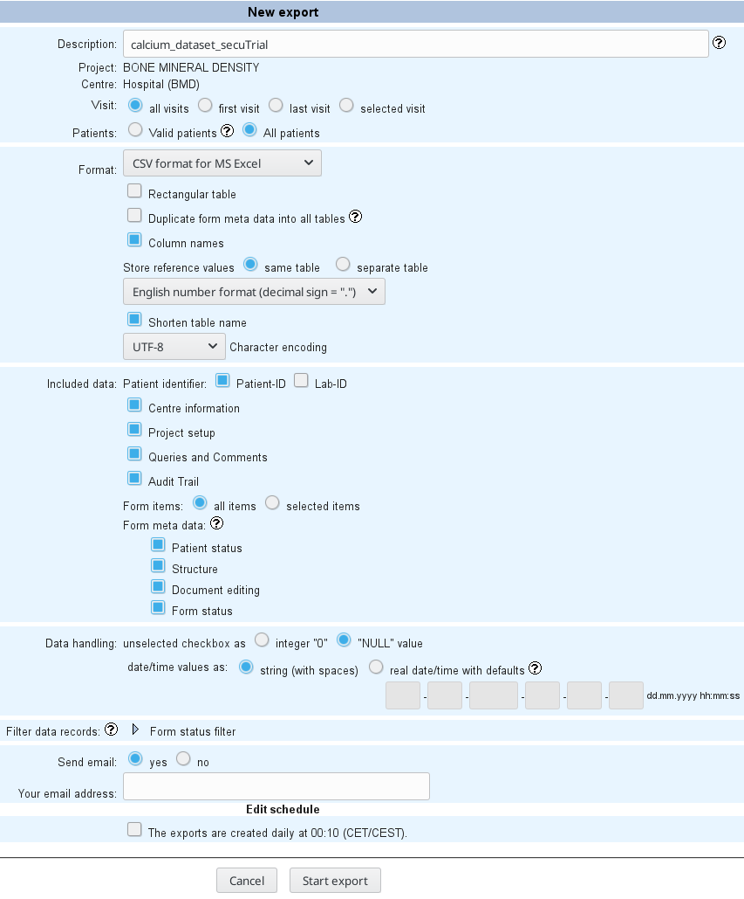
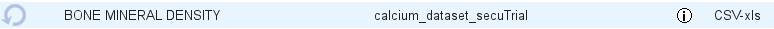
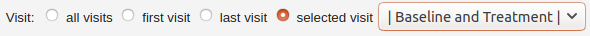
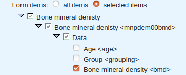
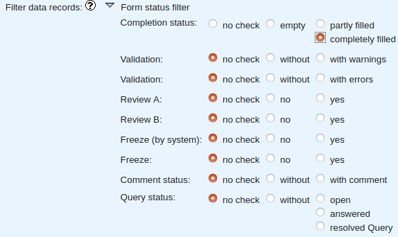

# secuTrial data export

During the course of a clinical trial or at its conclusion data commonly needs to
be exported from secuTrial. This can be achieved with the ExportSearchTool.
First we will explain how to run a simple full export of your database. In the second
part of the recipe we will outline options to export only subsets of the data
in a secuTrial database.

```
 Note: Your user account's role needs to be enabled 
       for exporting (AdminTool).
```

**Full data export:**  
1. ExportSearchTool
2. Click "Export"
3. Configure the export according to your needs (example in screenshot below; note that exporting the audit trail can slow down the export dramatically; saving reference values to a separate table can be useful for statistics software)

    

4. "Start Export"
5. Save your TAN
6. Click "Export completed"
7. Enter your TAN and "Submit TAN"
8. Save your export locally

```
 Note: You can reuse an old export configuration if you 
       click "Export history" or "Download" and then 
       click the circled arrow for the export that you 
       would like to repeat. The export will be supplied 
       with the current data.
```


**Exporting types of subsets in the data:**  
* The first option to subset is by visit. Thus, towards the top of the form at "Visit:" you may deviate
from the default ("all visits") and specify either the "first visit", "last visit" or a "selected visit"
which will open a drop down allowing you to select the visit of interest.

    

* The second option is to specify subsets of data based on "selected items" in the "Included data" section.
It is possible to select at form family (e.g. "Bone mineral density"), form (e.g. "Bone mineral density"),
question (e.g. "Data") or item (e.g. "Age", "Group", "Bone mineral density") resolution. Thus, subset selection
can go down to the level of selecting individual variables. In the example below only the data for the
"Bone mineral density" (i.e. \<bmd\> variable) will be exported.

  

* Another option is to filter your data based on the status of the forms. This can be specified in the
"Filter data records" section. The default is to export without any such checks. You could, however,
choose to export data only from forms which have been "completely filled" as specified below.
Selecting these options will affect all forms and can not be tailored to individual forms.

  

This recipe was tested under secuTrial version 5.5.1.10
