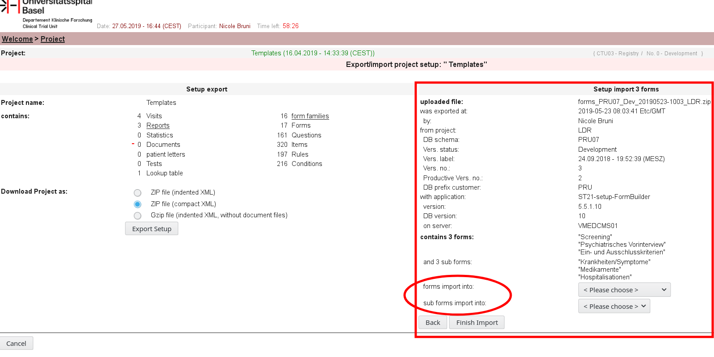

# secuTrail form import

When setting up CDMAs we often need the same or a similar form in another projecṭ ,,,,examples are "SAE forms" or "standard questionnnaries"). Forms in the same secuTrial environment may be copied directly. Forms from CDMAs in other environment need to be exported there (in the FormBuilder "Export/import project setup") and then imported into the CDMA in which the form is needed.

```
Note: check for uniqueness of the form name to be imported within the "form family"
Otherwise the newly imported form will get the name with a consecutively number behind.
```

### form import via FormBuilder
1. make sure the "form family" where the form will be imported exists (or create it)
2. in case the "form" to be imported contains "repetition" fields, consider where to save them (or create a correspondig "subform family")
1. select "Export/import project setup"
2. select "Browse" and find the ".zip-file of the exported form.
3. "Upload and Preview"
4. select the form family (i.e. of type "Visit" or "Casenode") in the drop-down "forms import into", if needed also select the subform-family where the repetitions are imported to.
"Finish import"


