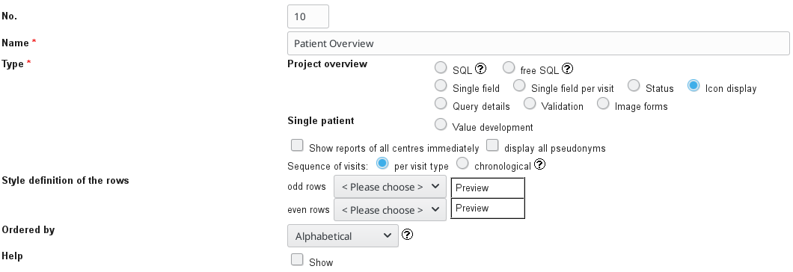
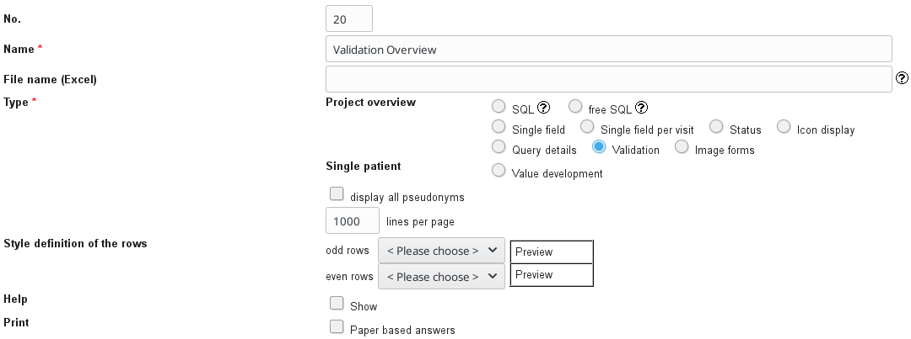
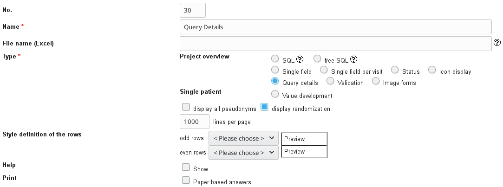

# Create overview reports

## Patient Overview

1. FormBuilder -> "Edit reports"
2. "New report"
3. Configure as in image below

    

4. AdminTool -> "Resources" -> "Reports" 
5. Select the report and release either for "all roles" or "selected roles" 

## Validation Overview

1. FormBuilder -> "Edit reports"
2. "New report"
3. Configure as in image below

    

4. AdminTool -> "Resources" -> "Reports" 
5. Select the report and release either for "all roles" or "selected roles"

## Query Details

1. FormBuilder -> "Edit reports"
2. "New report"
3. Configure as in image below

    

4. AdminTool -> "Resources" -> "Reports"
5. Select the report and release either for "all roles" or "selected roles"
 
