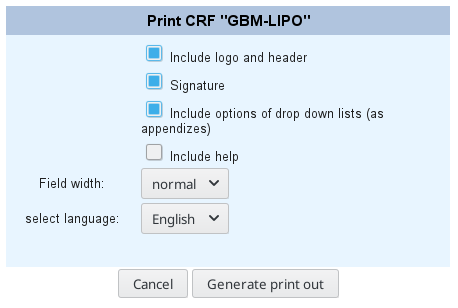

# Print secuTrial CRF

In some cases you may be asked to supply the CRF without having to supply a login to the secuTrial database.

1. FormBuilder
2. "Print CRF"

3. "Generate print out"

4. Save the zip file
5. To view the eCRFs extract the zip file into a dedicated directory.
6. The individual forms are the html files and can be opened via browser (e.g. firefox, chrome).

