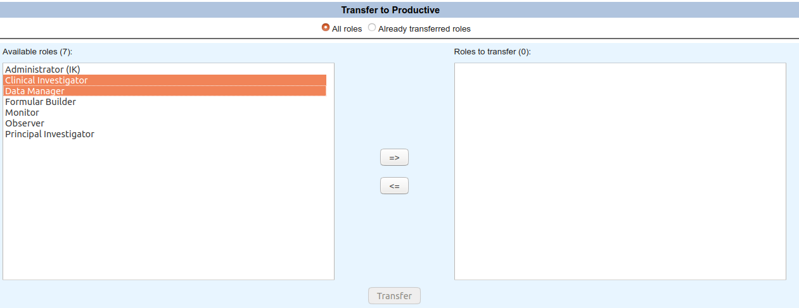

# Transferring roles from the setup area to the productive one

It is likely that you will create user roles in the setup environment to test if everything
is working as expected. Fortunately, you can transfer these to the productive environment
so you do not need to repeat the entire configuration process.

1. AdminTool (setup)
2. Click "Roles"

    

3. Click "Transfer to Productive"

    

4. Select roles to tranfer and click "=>"

    

5. Click "Transfer" 

    

This recipe was tested under secuTrial version 5.5.1.10
