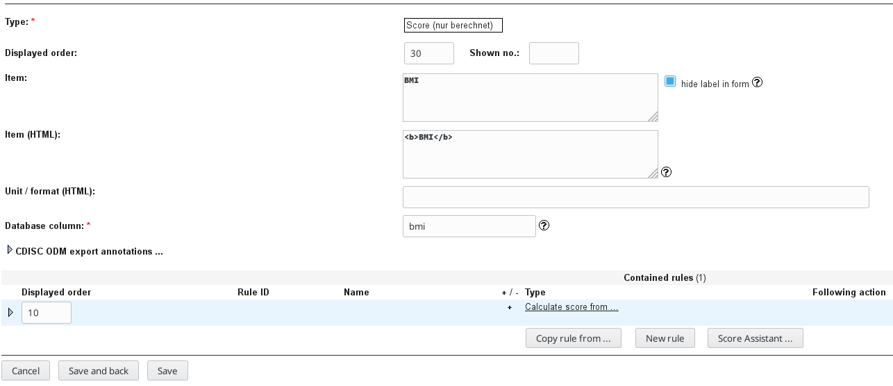
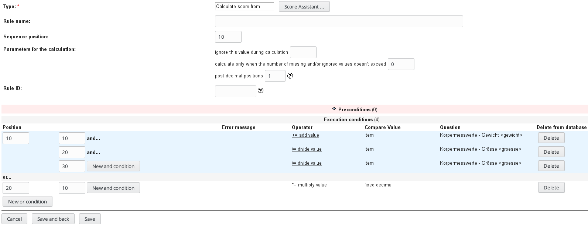

# secuTrial score implementation

Introduction to the formula
------

The implementation of a secuTrial score will be demonstrated in this recipe based on the [body mass index](https://en.wikipedia.org/wiki/Body_mass_index) (BMI). 

The formula is defined as:
BMI = mass [kg] / (height [m])^2

    ```diff
    - Note: Starting from secuTrial version 5.5.0.10 
    -       a "Score Assistant" is available.
    ```

Implementation:
1. It is assumed that you have already implemented the fields for mass and height. 
2. It is assumed that the height is entered in cm.
3. FormBuilder
4. Create a score item "BMI"
5. Create a "New rule" "Calculate score from ..."

    

6. Set the rule up as shown in the following screenshot. i.e. Add the weight value and divide it by the height twice. Then add a new or condition to multiply the value with the fixed integer 10000 to transform the unit from square cm to square meters.

    
