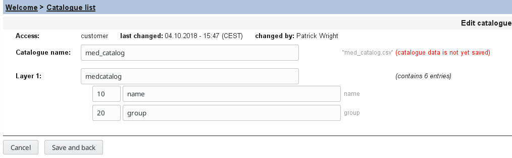
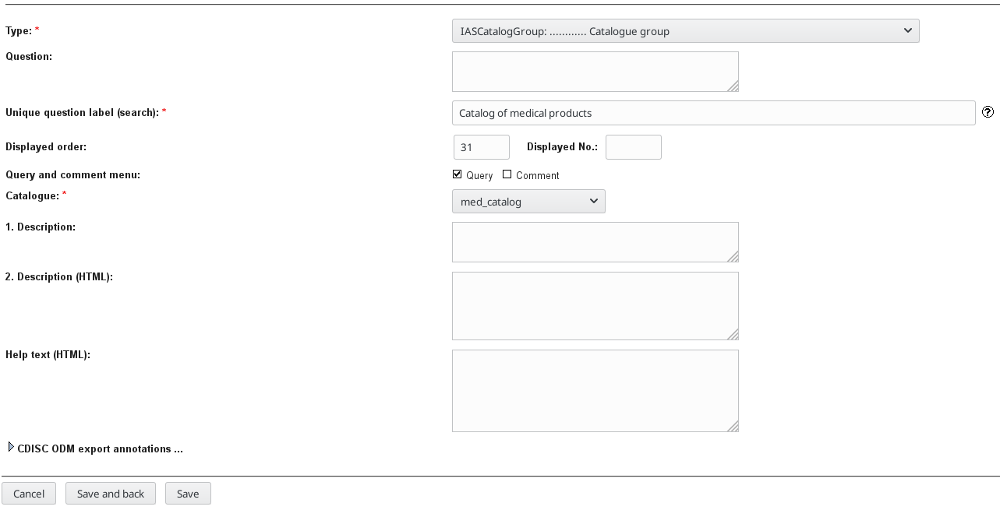
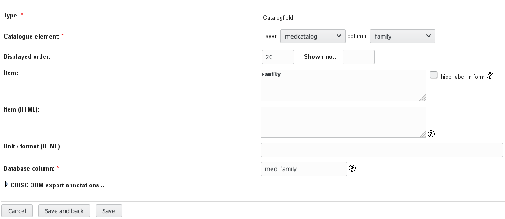
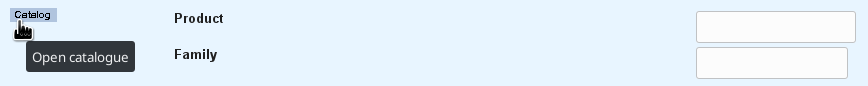
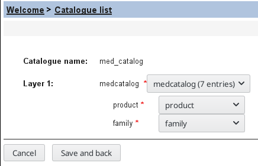

# secuTrial catalog upload 

Certain input data may already be available in a standardized form. In these cases a secuTrail catalog can be created to aid  in standardization of data entry. Examples where such catalogs are used are adresses or medicines. A small example catalog of medical products can be found [here](https://github.com/SwissClinicalTrialOrganisation/DM_secuTrial_data/blob/master/med_catalog.csv). A catalog of Swiss addresses can be found [here](https://github.com/SwissClinicalTrialOrganisation/DM_secuTrial_data/blob/master/plz_catalog_ch.csv).

#### Upload catalog:
1. FormBuilder Welcome page
2. Click "Catalogue list"
3. Click "Create new catalogue"
4. "Browse..." (e.g. [med_catalog.csv](https://github.com/SwissClinicalTrialOrganisation/DM_secuTrial_data/blob/master/med_catalog.csv))
5. Select encoding (e.g. UTF-8) and "Upload"
6. In the following window check entries and make adjustments to the text if needed. "Save and back"



#### Include catalog in eCRF:
1. Within a Form in the FormBuilder create "New question"
2. Type is IASCatalogGroup
3. Select your newly uploaded catalog (e.g. med_catalog) and "Save"



4. In the CatalogGroup create new items for your catalog entries (e.g. product and family). See below screenshot for family.



5. In DataCapture, your eCRF should now show the following. You can click "Catalog" and a pop-up opens where a selection can be made.



#### Update catalog

Some catalogs may continuously grow or change. Specifically certain medication from a catalog may become irrelevant while other products are added. In these cases incorporated catalogs may have to be updated. An example file for an updated version of the small medical product catalog from above can be found [here](https://github.com/SwissClinicalTrialOrganisation/DM_secuTrial_data/blob/master/med_catalog_update.csv). Alaxo has been removed while Ritalin and Valium have been added.

1. FormBuilder Welcome page
2. Click "Catalogue list"
3. Select the catalog you would like to update (e.g. med_catalog).
4. Click "Update catalogue"
5. Select the updated file (e.g. [med_catalog_update.csv](https://github.com/SwissClinicalTrialOrganisation/DM_secuTrial_data/blob/master/med_catalog_update.csv)) and specify the encoding (e.g. UTF-8)
6. Specify the mapping. "Save and back"

``` diff
- Note: Ideally your update file is formatted in the same way as your original file. 
```


7. Changes in the implementation of the eCRF are not needed.


